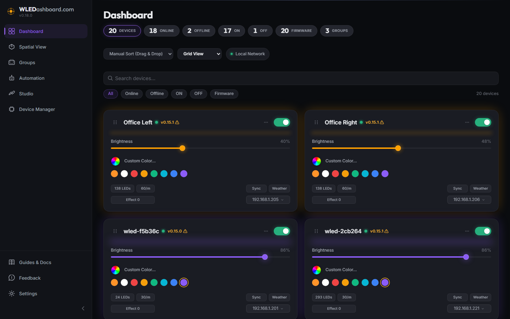
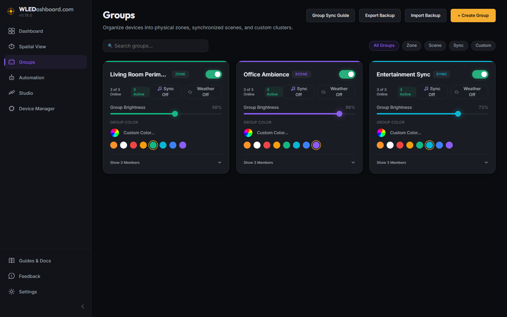
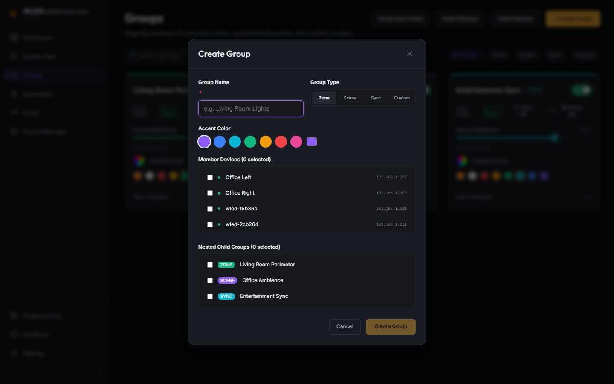
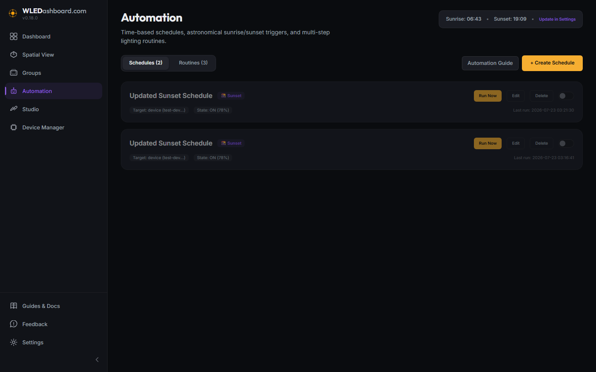
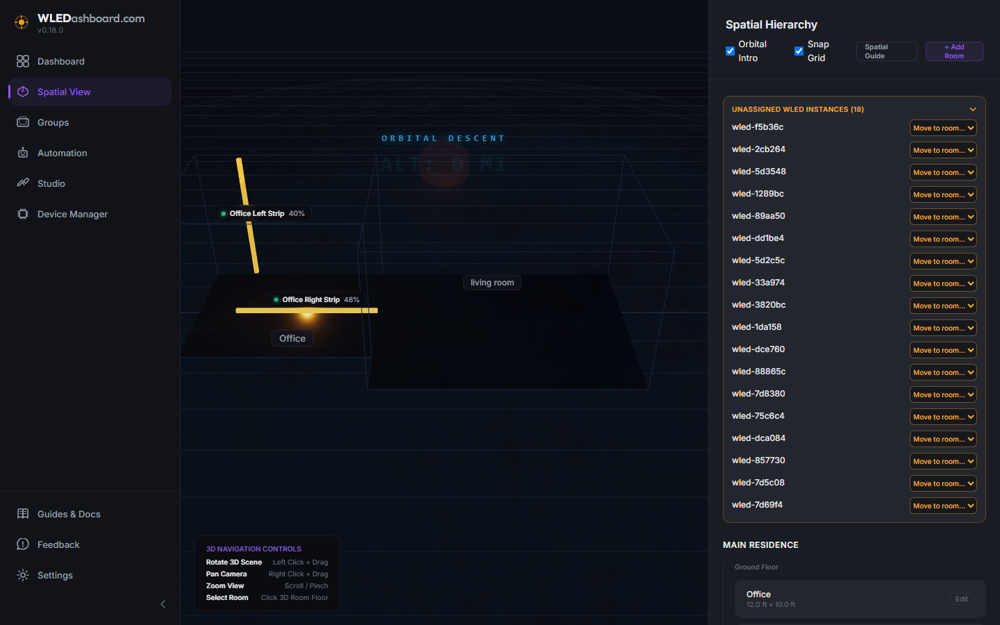
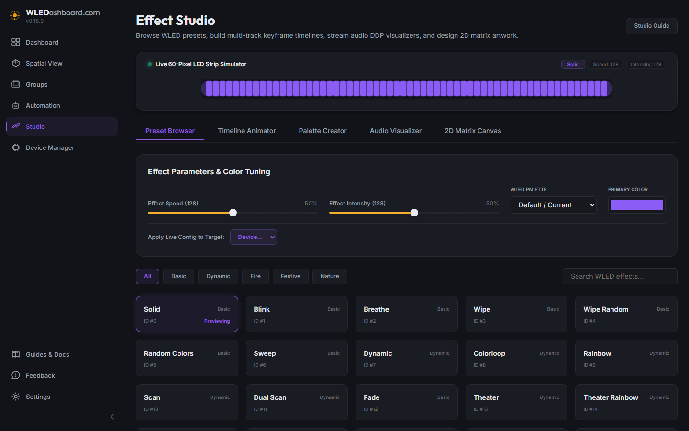
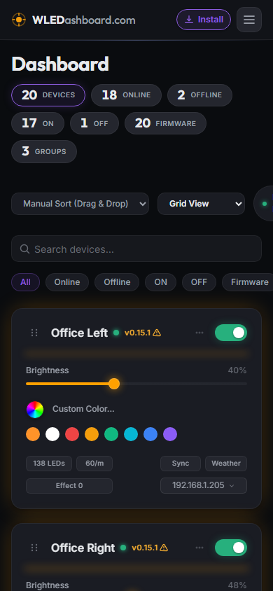

# WLEDashboard

A high performance, local first control surface for WLED devices. Control 1 to 100 or more LED controllers from a single responsive interface with spring physics animations, group management, and automatic mDNS network discovery.

---

## UI Highlights

### Dashboard

Control all your WLED devices with real time power toggles, dynamic brightness sliders with responsive color glow, anti-aliased conic-gradient color wheel pickers, four corner symmetrical hardware and action chicklets, and live telemetry headers.



### Group Management

Organize devices into physical zones, synchronized scenes, and custom lighting clusters. Control group power, group brightness, and group colors simultaneously with automatic device command distribution.



### Group Editor Modal

Easily build and customize lighting groups with custom color palettes, group type classifications (Zone, Scene, Sync, Custom), device member selection, and nested child group clustering.



### Automation & Schedules

Automate lighting based on fixed times or astronomical sunrise/sunset triggers (`suncalc`). Build multi-step routine timelines with custom delay intervals between step actions.



### 3D Spatial Viewport

Experience your lighting in 3D space with Three.js and React Three Fiber. View procedural room geometries, wireframe wall bounds, and real-time emissive LED light strips that pulse and glow matching actual device color and brightness. Includes a stunning holographic Earth orbital sequence.



### Effect Studio & Timeline Animator

Browse WLED built-in effect catalogs, build custom multi-track keyframe animation timelines, design multi-stop color gradients, and simulate light patterns on a live 60-pixel LED strip canvas.



### How-To & Architecture Documentation Hub

In-depth documentation hub integrated directly into the application with interactive tables, mobile installation instructions, group synchronization mechanics, and Home Assistant setup guides.


### Mobile Progressive Web App (PWA)

Install WLEDashboard directly to your mobile home screen on iOS and Android for a seamless full-screen native experience without browser navigation bars or address controls.



---

## Core Features

* **Local First Architecture**: SQLite storage with WAL journal mode. Zero cloud dependency, zero external account required, all data stays on your local network.
* **Automatic Device Discovery**: mDNS network scanning (`_wled._tcp`) automatically discovers WLED controllers on your local network and populates MAC addresses, firmware versions, and LED counts.
* **3D Spatial Viewport**: WebGL 3D canvas powered by Three.js & React Three Fiber. Render 3D floor plans, spatial light anchors, and real-time emissive light strip meshes.
* **Spring Physics Motion**: Dynamic damped harmonic oscillator spring engine drives interactive UI controls, toggle switches, hover elevations, and card transitions.
* **Group Management & Nesting**: Organize controllers into Zone, Scene, Sync, or Custom groups. Support for nested child groups and concurrent group command execution.
* **Automation & Schedules Engine**: Astronomical sunrise/sunset calculations (`suncalc`), time-based schedules, step-by-step routine timelines, and a 30s background scheduler loop.
* **Dashboard Group Clustering**: Instant toggle between individual device grid view and group cluster cards for high density setups.
* **JSON Configuration Backup**: Full export and import capabilities for backing up, restoring, or transferring dashboard state and device configurations.
* **Fastify & WebSocket Backend**: Fast Node.js API server with low latency WebSocket connection pushing live WLED state updates instantly to all connected clients.
* **Docker Ready**: Multi stage Docker container support with host networking for seamless local network mDNS multicast discovery.

---

## Architecture Overview

```
+-------------------------------------------------------------+
|                      WLEDashboard Web                       |
|   (Vite + React 19 + Zustand + Spring Physics Engine)       |
+------------------------------+------------------------------+
                               |
                               | HTTP / WebSocket
                               v
+-------------------------------------------------------------+
|                      WLEDashboard API                       |
|   (Fastify + SQLite WAL + mDNS Discovery + Polling Engine)  |
+------------------------------+------------------------------+
                               |
                               | LAN JSON API (/json/state)
                               v
+-------------------------------------------------------------+
|                     WLED Controllers                        |
|        [Device 1]       [Device 2]       [Device 3+]        |
+-------------------------------------------------------------+
```

---

## Deployment (Docker Compose)

WLEDashboard provides pre-built container images published to the GitHub Container Registry (`ghcr.io/upioneer/wledashboard:latest`). To ensure a consistent, zero-configuration environment across all operating systems, deployment via Docker Compose is the recommended installation method.

### Using Docker Compose (Recommended)

Create a `docker-compose.yml` file (or use the one included in the repository root):

```yaml
services:
  wledashboard:
    image: ghcr.io/upioneer/wledashboard:latest
    container_name: wledashboard
    restart: unless-stopped
    ports:
      - "8301:8301"
    volumes:
      - wledashboard_data:/app/data
    environment:
      - NODE_ENV=production

volumes:
  wledashboard_data:
```

Start the container in detached mode:

```bash
docker compose up -d
```

### Using Docker CLI

```bash
docker run -d \
  --name wledashboard \
  -p 8301:8301 \
  -e NODE_ENV=production \
  -e PORT=8301 \
  -e DATA_DIR=/app/data \
  -v wledashboard_data:/app/data \
  --restart unless-stopped \
  ghcr.io/upioneer/wledashboard:latest
```

Access the application in your browser at `http://localhost:8301`.

* Persistence: All configuration, groups, and device states persist in the `wledashboard_data` volume mounted to `/app/data`.
* Local Discovery: Standard bridge port mapping routes web traffic on port 8301 (preventing collisions with Z-Wave JS UI, Grafana, or Uptime Kuma). On Linux bare metal hosts or LXC containers where mDNS broadcast discovery across subnets is required, `network_mode: host` can optionally be configured.

### Updating WLEDashboard (Zero Downtime)

To update to the latest release without losing any configuration or database records:

```bash
docker compose pull && docker compose up -d
```

* Preserving Bookmarks: If upgrading from versions prior to v0.21.0 and you wish to keep browser bookmarks on port 3001, map `3001:8301` under the ports section in your `docker-compose.yml`.
* Automated Updates with Watchtower (Opt-In): The included `docker-compose.yml` provides a commented `com.centurylinklabs.watchtower.enable=true` label. Uncomment this label if you run Watchtower and wish to automate background container updates.

---

## Roadmap

* **MagicPlan / Polygon Floorplan Imports**: Interpret complex geometric shapes, L-shaped rooms, and non-rectangular walls to accurately reconstruct advanced 3D spatial layouts from popular floorplan apps.
* **Community Preset Hub**: Browse, download, and share custom pixel art and dynamic WLED effect presets with the community.
* **Multi-Instance Dashboard Sync**: Synchronize configuration across multiple browser tabs and devices in real-time.

---

## License & Copyright

Copyright (c) 2026 Jasen Henry. All Rights Reserved. See [LICENSE.md](LICENSE.md) for details.
