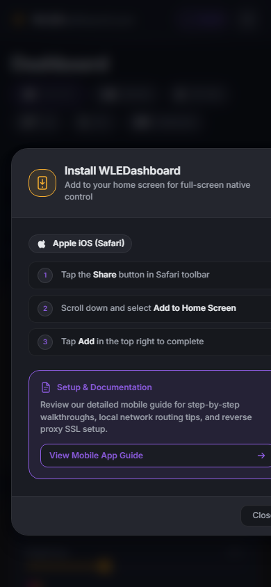
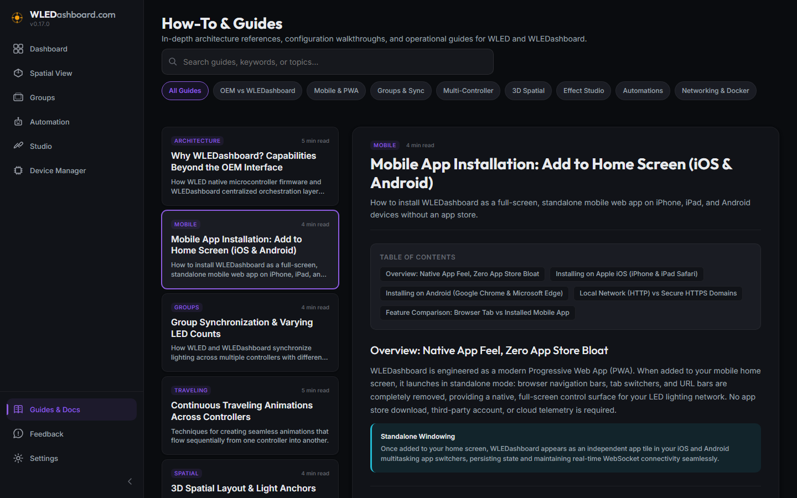
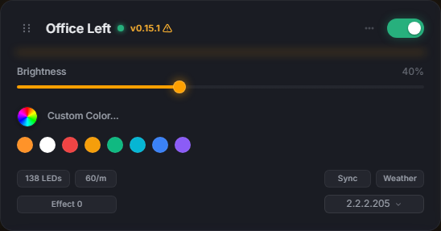
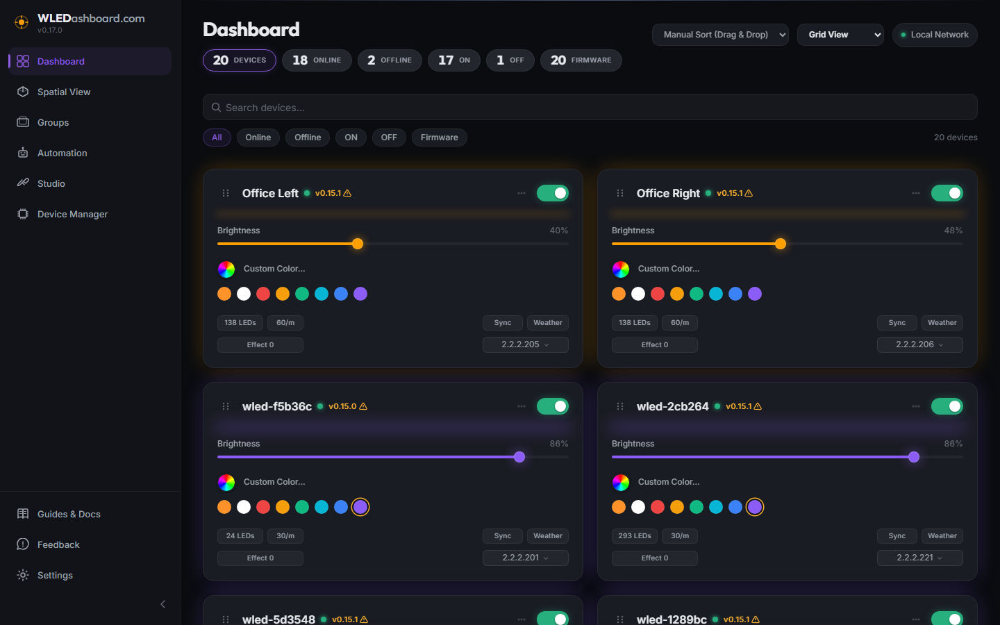

# v0.18.0 Release Walkthrough

## Summary
Version 0.18.0 introduces Progressive Web App (PWA) standalone mobile installation support, interactive IP address quick actions with configurable user preferences, a refined device card layout featuring an anti-aliased conic-gradient color wheel with balanced chicklet symmetry, a dedicated Home Assistant Integration guide, and clean CI/CD HACS validation.

---

## What Is New & Improved

### 1. Mobile Progressive Web App (PWA) & Add to Home Screen
* **Standalone Full-Screen Mode:** Configured web app manifest and mobile viewport metadata enabling WLEDashboard to launch in full-screen standalone mode without browser URL bars, tab switchers, or navigation chrome.
* **Dynamic Platform-Aware Install Button:** Added a responsive mobile navigation header with a dedicated "Install" action button. This button is dynamically hidden on desktop computers and automatically hidden when already running in standalone mode.
* **Apple iOS & Android Guidance Modal:** Clicking the install button opens an installation modal tailored to the user device:
  * On iOS: Displays step-by-step instructions for Safari Share sheet to Add to Home Screen.
  * On Android: Triggers direct one-click OS installation dialog when available, with browser menu fallback steps.
  * Links directly to the comprehensive Mobile Installation Guide in the Documentation Hub.
* **Documentation Guide:** Added the "Mobile App Installation: Add to Home Screen (iOS & Android)" guide under a new "Mobile & PWA" category in Guides & Docs.

### 2. Device Card Polish & Conic-Gradient Color Wheel
* **Circular Color Wheel Swatch:** Engineered an anti-aliased circular container with strict overflow clipping, eliminating browser conic-gradient rasterization bleeds and square edge artifacts.
* **Two-Row Chicklet Layout and 4-Corner Symmetry:** Structured device card metadata into two symmetrical rows forming an aligned four corner grid:
  * Row 1: Hardware specs (LED count, density) on left (width locked to 124px); width locked 124px Sync and Weather quick action chips on right.
  * Row 2: Lighting effect on left (width locked to 124px matching hardware specs); width locked 124px IP chicklet on right.
* **Firmware Telemetry Header:** Relocated firmware version to the top bar beside the device name. Outdated devices display an amber warning triangle icon without cluttering text.
* **Card Scoping Fix:** Resolved card background styling issue by strictly scoping green status styling to the indicator dot.
* **Brand Mark Polish:** Updated top-left logo to `WLEDashboard.com` with `.com` styled in secondary grey matching `ashboard`.

### 3. Home Assistant Integration & Documentation
* **Dedicated Setup Guide:** Added "Home Assistant Integration: Manual Setup, HACS & MQTT Auto-Discovery" to the Documentation Hub under a new "Home Assistant" category.
* **Multi-Method Deployment:** Clarified that users can immediately integrate WLEDashboard via manual component copy, HACS custom repository, or native MQTT Auto-Discovery without waiting for official store directory approvals.
* **Entity & Service Reference:** Documented room lights, group lights, routine buttons, sync switches, and custom automation services.

### 4. IP Address Quick Actions & Settings Preference
* **Interactive IP Popover:** Clicking any device IP chicklet presents a contextual popover offering "Open in New Tab" and "Copy IP Address" with visual feedback.
* **Configurable Default Action:** Added a user preference in Settings > Preferences allowing users to choose their default click behavior:
  * Open WLED instance directly in a new browser tab.
  * Copy device IP address to clipboard.
  * Show the interactive quick action menu.
* **Universal Clipboard Utility:** Integrated fallback clipboard handler ensuring reliable copying across non-HTTPS local network origins.

### 5. Automated Testing & Continuous Integration
* **HACS CI Validation Fix:** Updated HACS validation workflow with space-separated check bypasses (`ignore: "brands license"`), ensuring clean, 100% green checks on remote commits.
* **14 Unit Tests:** Automated test suites covering color conversions, semantic version comparisons, binary URL sanitization, PWA environment detection, and SQLite migrations.
* **CI Quality Gate:** Integrated `npm test` into the GitHub Actions Docker publishing pipeline.

---

## Operational Notes
* No database migrations or schema alterations are required for this release.
* All existing user configurations and preferences are fully preserved.
