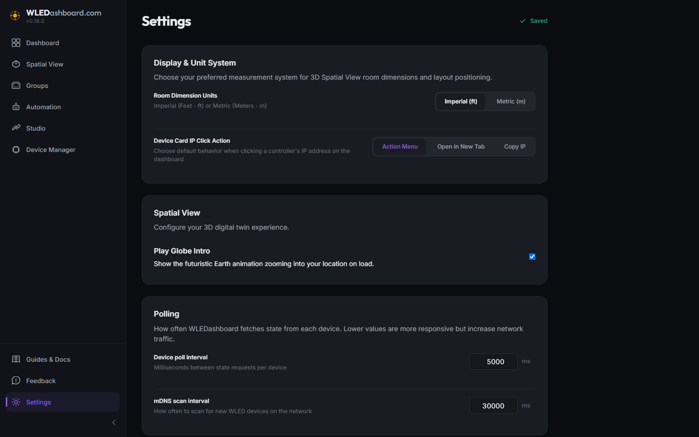

# v0.19.0 Release Walkthrough

## Summary
Version 0.19.0 delivers Instant Settings Auto Save, eliminating manual save buttons across configuration panels in favor of continuous debounced inputs and immediate discrete control saves with live status indicators. This release also resolves critical GitHub community reports, including WLED firmware version persistence after Over The Air updates (Issue #1) and Fastify route schema rejections when toggling 3D Spatial View intro animations (Issue #2), alongside establishing an immutable GitHub issues registry.

## What Is New & Improved

### 1. Instant Settings Auto Save
* Seamless Persistence: Removed the legacy Save Changes button in Settings. All preferences, credentials, and polling configurations now save the instant they are altered.
* Smart Debounce and Blur Synchronization: Continuous text and numerical inputs employ a 400ms debounce buffer to avoid excessive database writes while users type, with immediate write through when input fields lose focus.
* Real Time Save Status Indicator: Added a live status badge in the Settings header displaying animated saving spinners, green success checkmarks, error alerts, and idle states ("Saving...", "Saved", "Failed to save", "All changes saved").
* Discrete Toggles and Selectors: Measurement unit selectors, IP chicklet default actions, and spatial options persist instantaneously upon interaction without waiting for debounce timers.

### 2. Resolution for GitHub Issue #1: WLED Firmware Version Persistence
* SQL Precedence Fix: Resolved an SQL ordering inversion in deviceService.js where existing database records superseded newly polled firmware versions from controllers. Polled telemetry now takes authoritative precedence over historical database values.
* Dynamic Polling Change Detection: Enhanced background polling to actively detect and write updates to SQLite whenever WLED controllers report updated firmware versions, LED counts, or MAC addresses.
* API and Schema Support: Expanded UpdateDeviceSchema to permit firmware version updates and updated controller update routines accordingly.
* Store and UI Live Fallbacks: Updated client store state patching to update firmware versions and LED counts immediately upon receiving WebSocket state frames. Added safety fallbacks to device live state across Dashboard, Device Card, and Device Manager views.

### 3. Resolution for GitHub Issue #2: Spatial View Orbital Intro Toggle
* Route Schema Expansion: Resolved Fastify HTTP 400 Bad Request rejections on PATCH /settings by expanding the Zod validation schema to accept boolean, number, string, and null payload values.
* Safe Boolean String Normalization: Implemented robust boolean coercion across 3D Spatial View components, ensuring SQLite string storage cleanly handles boolean toggles without crashing or throwing notification errors.

### 4. Immutable GitHub Issues Registry
* Established an immutable historical record in project_details/github_issues.md documenting all community reported issues, reporting contributors, affected releases, resolution versions, root cause analyses, and test proof.

### 5. Documentation and Cleanups
* Removed the legacy Verification and Testing section from README.md.

## Operational Notes
* No database migrations or schema alterations are required for this release.
* All existing user configurations and preferences are preserved without changes.
