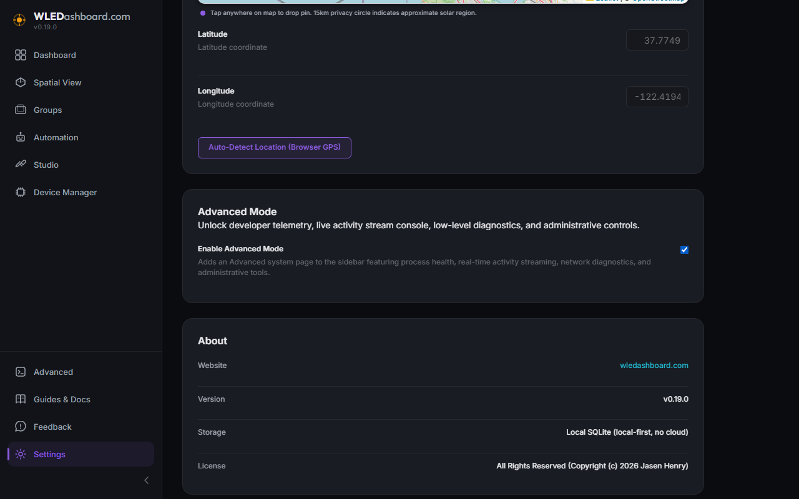
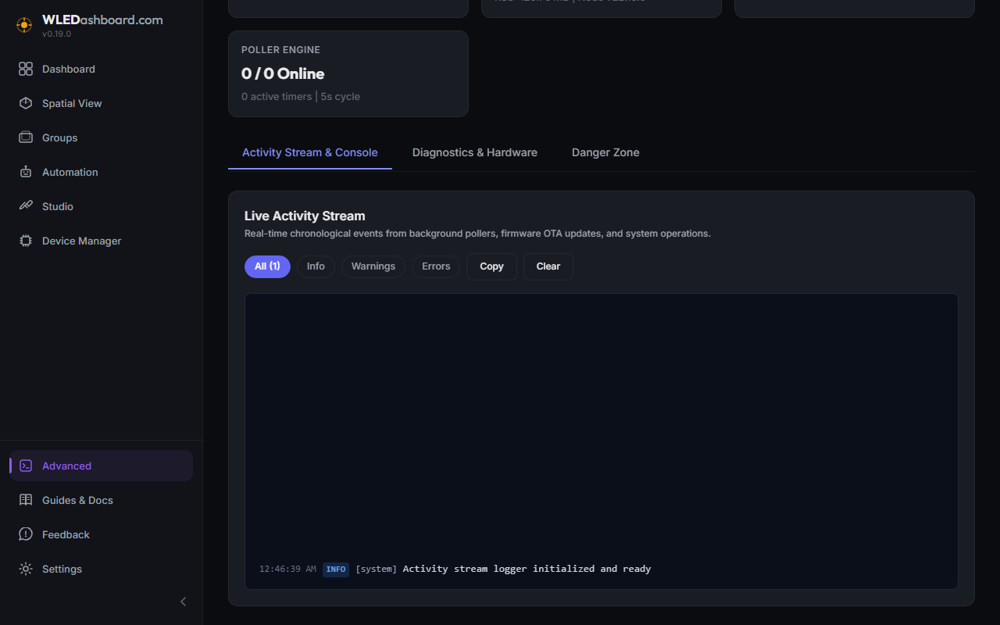
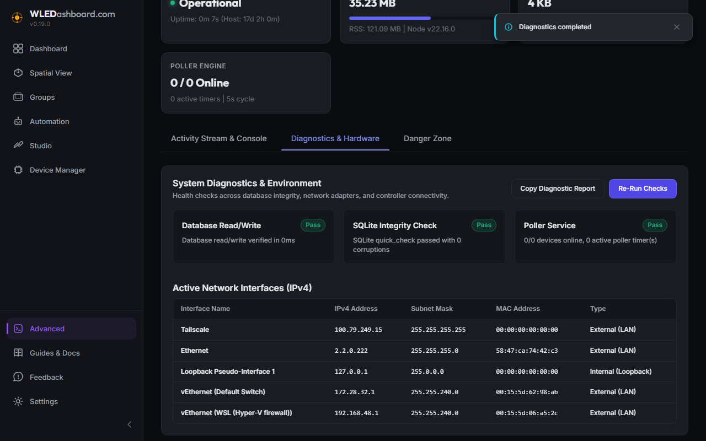
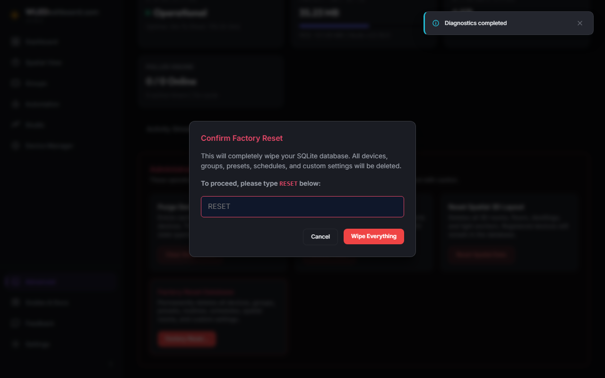
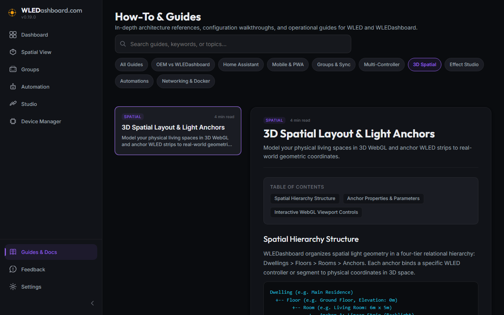

# v0.20.0 Release Walkthrough

## Summary
Version 0.20.0 introduces the Advanced System Dashboard, bringing low level process health telemetry, real time activity console streaming, deep hardware diagnostics, and administrative control tools directly to WLEDashboard. In addition, this release completely resolves WLED OTA firmware update failures by aligning multipart form specifications and introducing dual route browser fallbacks, unifies toast notification user experience, and fixes category pill filtering when navigating from Effect Studio.

## What Is New & Improved

### 1. Advanced System Dashboard & Developer Tools
* Advanced Mode Preference: Added an Advanced Mode toggle in Settings that dynamically introduces an Advanced navigation link immediately above Guides & Docs in the sidebar.
* System Health Telemetry: Real time KPI metrics for Process Status, System Uptime, Node runtime version, Memory Heap utilization progress meter, and SQLite database storage footprint.
* SQLite Database Inspection: Visual breakdown of table records across devices, groups, presets, routines, schedules, and spatial 3D rooms, along with SQLite WAL journal mode reporting.
* Poller Engine Monitoring: Displays active background interval timers, monitored controller count, online versus offline counts, and polling cycle frequency.

### 2. Live Activity Stream & Console
* Real Time Event Ring Buffer: Captures live events from background polling workers, device state transitions, firmware OTA upload operations, and system actions without burdening disk I/O.
* Level Filtering: Filter logs instantaneously by All, Info, Warnings, or Errors.
* Console Management: Includes real time stream auto refresh toggling, one click buffer clearing, and clipboard copy for rapid sharing and log inspection.

### 3. System Diagnostics & Hardware Verification
* Database Read and Write Verification: Performs automated latency testing on SQLite read and write cycles.
* SQLite Quick Integrity Check: Executes SQLite quick integrity checks to detect database corruption or index anomalies.
* Poller Service Health: Inspects active polling timers against configured controllers.
* Controller Connectivity Probes: Dispatches concurrent latency probes to all registered WLED devices to detect reachability, network latency, or offline states.
* Active Network Adapters Table: Enumerates all host IPv4 network adapters, subnets, and MAC addresses, assisting users in diagnosing Docker bridge networks and local subnet isolation issues.
* Copy Diagnostic Report: Formats a complete markdown and JSON report with one click for GitHub issue submissions.

### 4. Administrative Danger Zone
* Purge Device State Cache: Evicts cached device states, forcing the background poller to perform fresh state queries on the subsequent cycle.
* Restart Poller Timers: Cancels running interval timers and cleanly re initializes background workers for all registered controllers.
* Reset 3D Spatial Layout: Safely clears all dwellings, floors, rooms, and light anchors while keeping device records intact.
* Database Factory Reset Modal: Full database factory reset with explicit typing safeguards requiring the user to type RESET before wiping tables and restoring factory baseline settings.

### 5. Microcontroller Firmware Update Reliability
* Form Field Name Alignment: Aligned the multipart file field name from file to update (with fallback to file), satisfying WLED ESPAsyncWebServer endpoint requirements.
* Microcontroller Error Extraction: Inspects microcontroller response bodies to detect subnet restrictions, OTA locked status, and in body failure messages returned on HTTP 200 responses.
* Extended Upload Limits: Increased Fastify multipart upload limit to 16MB and timeout to 120 seconds with AbortController cancellation.
* Dual Route Browser Fallback: If server proxy uploads encounter Docker network isolation or local subnet rejections, the frontend automatically falls back to direct browser to controller upload via CORS.

### 6. Persistent Error Toasts & UX Unification
* Persistent Error Notifications: Error toasts now set duration to zero, remaining permanently visible on screen until explicitly closed by the user.
* Spatial View Toast Unification: Silenced success toast spam when toggling visual checkboxes like Orbital Intro in Spatial View, matching the silent behavior of Snap Grid while maintaining error alerts.
* Snap Grid Persistence: The Snap Grid setting in Spatial View now persists cleanly in localStorage across browser sessions.

### 7. Guides & Docs Category Pill Navigation Fix
* Resolved an issue where navigating to Guides & Docs via the Studio Guide link locked category pill selection.
* Decoupled URL query parameter synchronization from active category state, ensuring category pills switch smoothly without being forced back to All Guides.

## Operational Notes
* No destructive migrations or manual database steps are required.
* All existing configurations, groups, spatial layouts, and device pairings are fully preserved.
