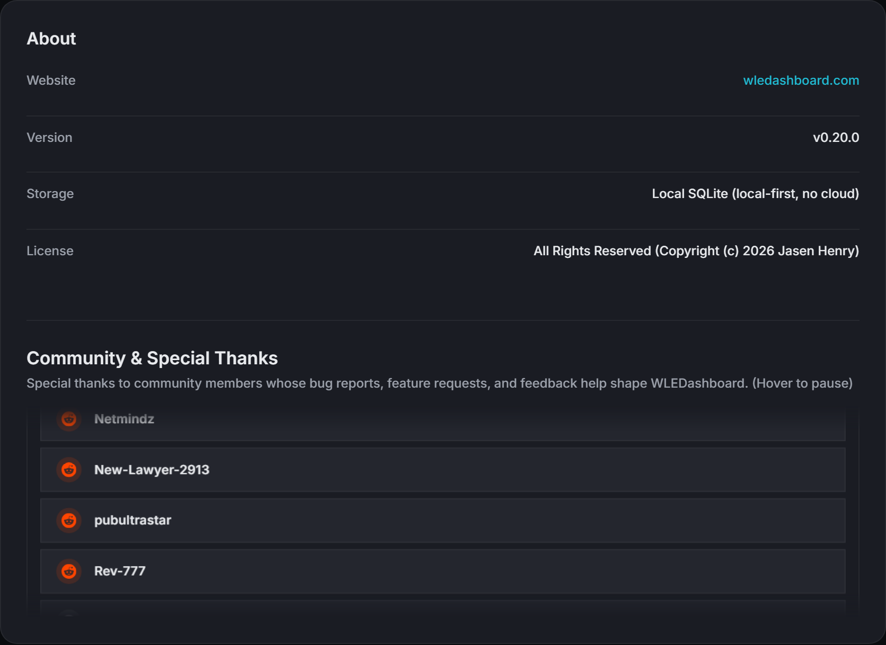
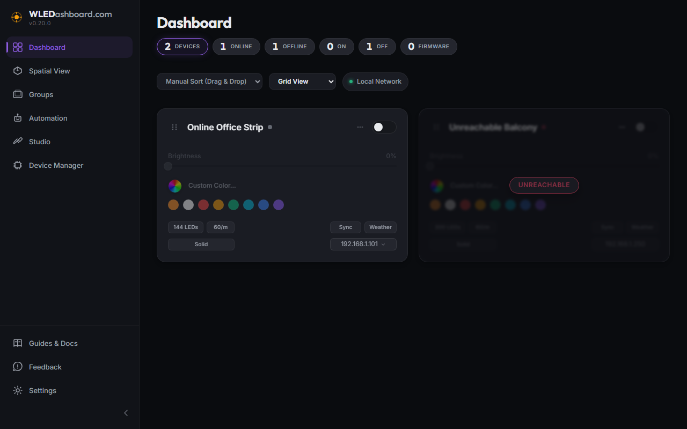

# v0.21.0 Release Walkthrough

## Summary
Version 0.21.0 introduces key networking, ergonomics, and community updates across WLEDashboard. Default application networking moves from port 3001 to 8301 across container runtimes and Home Assistant integrations, resolving port collisions with Z Wave JS UI. In 3D Spatial View, viewport navigation mouse bindings are swapped to establish intuitive controls where Left Click + Drag controls Camera Pan and Right Click + Drag controls Scene Rotation. The Settings About section now features an infinite vertical marquee showcasing community contributors who have provided bug reports, feature requests, and deployment feedback. In addition, this release adds custom discovery IP range scanning in Advanced settings, disables UI controls on unreachable devices to prevent failed API calls, embeds one click diagnostic report generation into project contribution guidelines, and introduces automated ad hoc contributor synchronization tooling.

## What Is New & Improved

### 1. Default Network Port Relocation to 8301
* Z Wave JS UI Collision Elimination: Shifted the default port from 3001 to 8301 across Dockerfile, docker-compose.yml, API configuration, and Home Assistant custom component definitions.
* Zero Port Collision In Home Assistant: Users deploying WLEDashboard alongside Z Wave JS UI inside Home Assistant or Docker networks no longer experience address binding conflicts.
* Documentation Alignment: Updated deployment guides, setup playbooks, and environment variable documentation to consistently reference port 8301.

### 2. 3D Spatial Navigation Mouse Control Ergonomics
* Left Click Pan Camera: Left Click + Drag in the 3D spatial viewport now pans the camera parallel to the viewing plane.
* Right Click Rotate 3D Scene: Right Click + Drag in the 3D spatial viewport now orbits and rotates the 3D scene around the focal target.
* Synchronized Navigation Legend: Updated the in canvas 3D Navigation Controls overlay in Spatial View to immediately reflect the new mouse interaction mappings.
* Backlog Tracking: Recorded a future task in the project backlog to provide a user configurable toggle in Settings or Spatial View to swap mouse bindings on demand.

### 3. Community & Special Thanks Marquee
* Vertical Infinite Scroll: Added a continuous vertical marquee in Settings > About displaying verified community members whose bug reports, feature requests, and technical feedback shape WLEDashboard.
* Clean Typography and Zero External Links: Sized to show four to five rows with top and bottom gradient fade masks. Each row displays only the platform icon and contributor handle with no distracting external links.
* Strict Alphabetical Ordering: Contributor handles are sorted alphabetically via unicode base sensitivity.
* Interactive Hover Pause: Hovering over the marquee pauses the scrolling animation, allowing users to comfortably read entries.

### 4. Offline Device Card Safeguards
* Interaction Guarding on Unreachable Units: When a WLED device is unreachable or offline, the device card automatically disables brightness sliders, quick action toggles, and preset selection controls.
* Prevention of Failed API Loops: Prevents users from dispatching failing network commands to offline microcontrollers, preserving system responsiveness and avoiding log clutter.
* Clear Visual Indication: Renders clean disabled states on cards and IP chips while keeping telemetry accessible for diagnostic inspection.

### 5. Custom Discovery Range & Network Safeguards
* Advanced Discovery Scope: Added an optional configuration field in Advanced settings allowing administrators to define custom IP subnets for mDNS and network discovery.
* Complex Network Support: Enables scanning non standard local ranges outside default RFC private subnets without requiring host network mode.
* Architectural Documentation: Added detailed guides explaining security safeguards against private IP exposure when routing through Tailscale, Cloudflare tunnels, or remote VPNs.

### 6. Enhanced Contributing Guidelines & Diagnostic Integration
* Copy Diagnostic Report Integration: Updated project contribution documentation to instruct users reporting bugs to leverage the Copy Diagnostic Report button in the Advanced Diagnostics tab.
* Pre Formatted Markdown JSON Telemetry: Enables users to paste structured system telemetry directly into GitHub issues without manual formatting.
* Community Discussion Redirect: Updated contribution documentation to point community discussions directly to the active Reddit thread while removing disabled GitHub Discussions references.

### 7. Contributor Synchronization Automation Playbook
* Ad Hoc Source Scraping: Created an operational playbook at project_details/playbooks/sync_contributors.cjs to scrape and classify actionable contributors from GitHub issues and Reddit threads.
* Automated Filtering: Filters out superficial praise and bots while capturing bug reports, feature requests, and deployment feedback.
* Dry Run and Apply Modes: Supports dry run diff inspections and automated updates to Settings.jsx.

## Operational Notes
* Existing installations migrating to v0.21.0 should update port mappings in their docker-compose.yml files to 8301:8301 if previously using the default 3001.
* No database migrations are required for this release. All existing devices, groups, spatial hierarchies, and automations remain intact.
