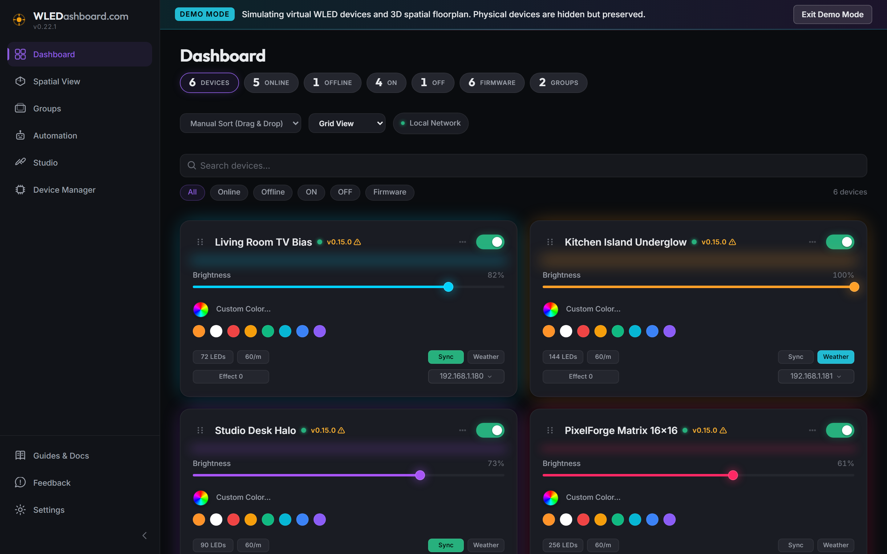
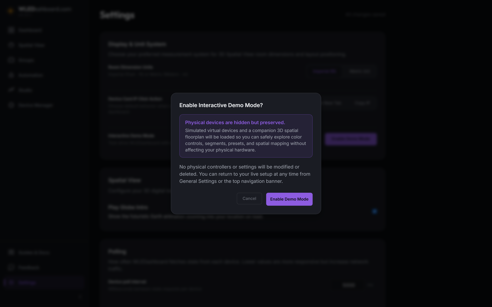
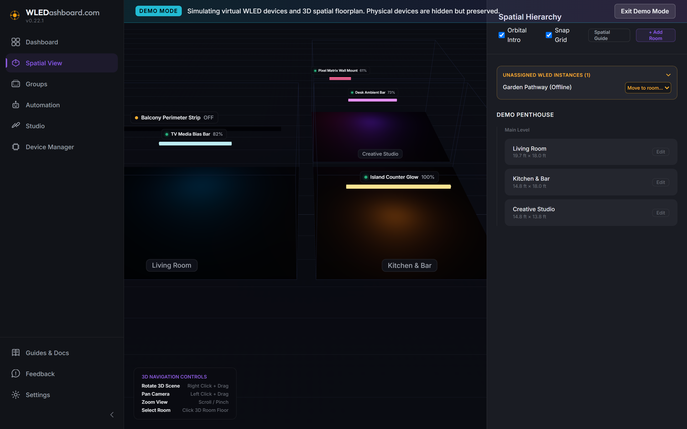

# v0.23.0 Release Walkthrough

## Summary
Version 0.23.0 introduces an Interactive Demo Mode virtualization engine, automated Proxmox LXC installation tooling, hardened mobile Progressive Web App (PWA) runtime execution with full WebAPK compilation support, and detailed operational documentation for Cloudflare Tunnels, reverse proxies, and Spotify OAuth integration. The virtualized demo mode enables users to explore WLEDashboard with zero physical microcontrollers attached, featuring five responsive simulated fixtures across realistic operational states, a synchronized 3D digital twin floorplan, virtualized grouping, and in-memory simulated OTA firmware updating. Mobile runtime enhancements provide an active Service Worker with dual-pipeline traffic management for instant shell caching while passing real-time WebSocket and hardware control traffic directly over the network. Finally, native Proxmox Community Helper installation scripts under `install/proxmox/` deliver a one-command turnkey LXC container deployment on Debian 12 with automatic Node.js 22 LTS provisioning and systemd process management.

## What Is New & Improved

### 1. Interactive Demo Mode & Hardware Virtualization
* Zero Hardware Virtualized Sandbox: Added an in-memory hardware simulation engine toggleable on demand from Settings. Allows prospective users, UI evaluators, and developers to explore the full dashboard without attaching physical ESP32 or ESP8266 controllers.
* Realistic Fixture State Diversity: Simulates five unique WLED fixtures spanning real-world environments and operational states:
  * Living Room Strip (Online, RGB warm white ambient bias, multi-segment).
  * Kitchen Island (Online, cold white, active Colorloop effect).
  * Patio String Lights (Online, festive palette, outdated firmware indicator `v0.14.4`).
  * Bedroom Matrix (Online, 16x16 2D matrix surface, Fire flicker effect).
  * Accent Ring (Offline, unreachable safeguard test unit).
* In-Memory State Mutation: Toggling power, sliding brightness, adjusting color values, and changing effects mutate in-memory state models instantly, reflecting live UI updates without writing mock data to the physical SQLite database.
* Digital Twin 3D Spatial Integration: Injects companion virtual spatial rooms and device anchors into 3D Spatial View, allowing users to orbit, pan, and inspect 3D multi-room synchronizations.
* Simulated OTA Firmware Updates: Patio String Lights (`v0.14.4`) exposes an interactive outdated firmware chip. Triggering the update opens a confirmation modal, runs a simulated OTA flash sequence with cyan pulsing indicators, and updates live runtime state to `v0.15.0`.
* Physical Data Isolation & Safety: Entering demo mode displays a top banner and explanatory modal confirming that physical devices and database records remain hidden and completely preserved. Exiting demo mode immediately restores the physical fleet.

### 2. Proxmox LXC Automated Turnkey Installation Suite
* Proxmox Community Helper Scripts: Created a turnkey installation suite in `install/proxmox/` conforming to Proxmox VE community deployment conventions:
  * `wledashboard.sh`: Host execution runner providing interactive container configuration or automated default provisioning (Container ID, hostname, storage pool, memory, disk size).
  * `wledashboard-install.sh`: Guest OS container provisioner for Debian 12 baseline setup, Node.js 22 LTS runtime configuration, build dependencies for native SQLite3 compiling, and repository extraction.
  * `build.func`: Shared modular execution library for container lifecycle orchestration, network validation, storage detection, and colored console reporting.
* Systemd Service Management: Generates and enables a dedicated `wledashboard.service` systemd unit running with automatic restart policies and production environment flags on port 8301.
* Turnkey Discovery Network: Integrates bridge and host network recommendations for seamless mDNS multicast discovery on Proxmox VE hosts.

### 3. Mobile Runtime Upgrade & PWA WebAPK Support
* Native WebAPK Compilation: Upgraded mobile Progressive Web App capabilities to meet strict Chromium and Microsoft Edge standalone requirements, enabling Android devices to mint independent WebAPKs directly into the native App Drawer without browser chrome.
* Service Worker Dual-Pipeline Traffic Architecture: Implemented an active Service Worker (`sw.js`) with intelligent request segregation:
  * Cache-First Application Shell: Precaches Vite application bundles, icons, and static assets for instantaneous launch times and resilient caching.
  * Direct-To-Network Pass-Through: Strictly routes real-time WLED hardware commands, `/api/*` endpoints, and `/ws` WebSocket connections directly over the network with zero service worker cache interference.
* Development Mode Isolation: Configured the web application bootstrap (`main.jsx`) to unregister existing service workers during local development (`!import.meta.env.PROD`), preventing hot-module replacement conflicts.
* Adaptive Iconography & Manifest Overrides: Updated `manifest.webmanifest` with discrete maskable and standard icon definitions alongside `display_override: ["standalone", "minimal-ui"]` declarations.

### 4. Guides & Documentation: Remote Access, Reverse Proxies & Spotify OAuth
* Remote Access Master Guide: Added a comprehensive user guide in Guides & Docs titled "Remote Access: Cloudflare Tunnel, Reverse Proxies & Spotify OAuth" (`cloudflare-tunnel-reverse-proxy`).
* HTTPS and PWA Prerequisite Coverage: Detailed cryptographic HTTPS requirements enforced by modern mobile operating systems for Service Worker registration and WebAPK compilation.
* WebSockets & Ingress Rule Formatting: Provided sample `cloudflared` configuration blocks illustrating WebSocket upgrades and localhost origin routing.
* Spotify OAuth URI Clarification: Documented the critical architectural distinction in the Spotify Developer Dashboard between the metadata Website URL and the exact callback Redirect URI (`https://your-domain.com/api/spotify/callback`).
* Contextual Settings Guidance: Updated Spotify settings cards with direct deep-links to documentation and inline helper guidance.

### 5. Community Contributors
* Added Reddit contributor `Far_Confusion4003` to the Special Thanks infinite marquee in Settings for reporting mobile PWA installation behaviors on Android.

## Operational Notes
* Upgrading to v0.23.0 is completely non-destructive and requires no manual database migrations.
* To launch the interactive demo mode, navigate to Settings > General and toggle Interactive Demo Mode.
* For Proxmox LXC installation, review the scripts located in `install/proxmox/`.
